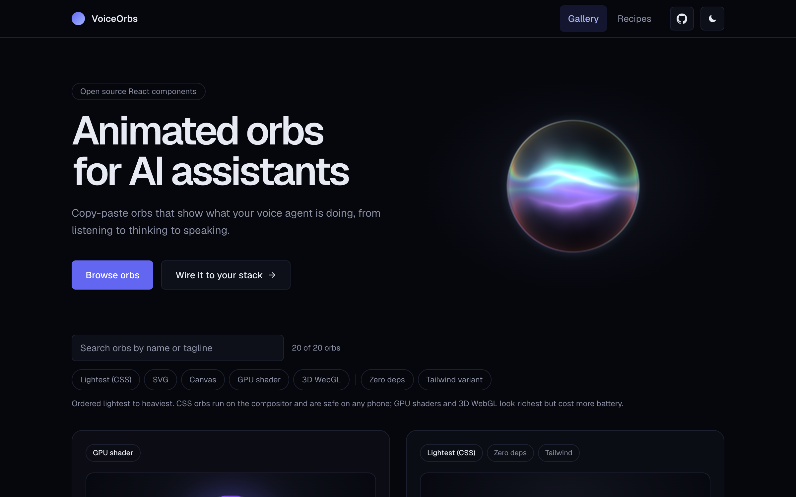

# VoiceOrbs

Copy-paste animated orbs for AI voice assistants. 20 audio-reactive React components sharing one 7-state contract: browse the gallery, copy the code or an AI prompt, wire it to your provider.

[](LICENSE)
[](https://voiceorbs.vercel.app)
[](https://github.com/amunozdev/voiceorbs)

<picture>
  <source media="(prefers-color-scheme: light)" srcset="docs/assets/hero-light.png">
  <source media="(prefers-color-scheme: dark)" srcset="docs/assets/hero-dark.png">
  
</picture>

## The orbs

| Orb | Tech | Tagline |
| --- | --- | --- |
| [Plasma Orb](https://voiceorbs.vercel.app/orbs/plasma-orb) | Shader (canvas) | Shader mesh gradient on canvas, no Three.js. Organic distortion. |
| [Equalizer Orb](https://voiceorbs.vercel.app/orbs/equalizer-orb) | Pure CSS | Equalizer bars inside a disc that react to the audio level. |
| [Halo Orb](https://voiceorbs.vercel.app/orbs/halo-orb) | Pure CSS | A conic halo with orbital rings and a bright core that pulses. |
| [Particles Orb](https://voiceorbs.vercel.app/orbs/particles-orb) | Canvas | Hundreds of particles form a rotating 3D sphere that breathes with your voice and scatters into a ring while connecting. |
| [Siri Sheet](https://voiceorbs.vercel.app/orbs/siri-sheet) | Shader (canvas) | Glass sphere with a luminous sheet of light inside; the rim refracts and splits color. Raw WebGL, zero dependencies. |
| [Siri Wave Line](https://voiceorbs.vercel.app/orbs/siri-wave-line) | Canvas | Overlapping fluorescent sine waves that flatten at rest and surge with the voice. |
| [Pulse Orb](https://voiceorbs.vercel.app/orbs/pulse-orb) | Pure CSS | Core with expanding rings and a loading arc. Minimal and SSR-safe. |
| [Glass Orb](https://voiceorbs.vercel.app/orbs/glass-orb) | Pure CSS | Iridescent glassmorphism with a spinning conic aura and specular highlight. |
| [Aurora Orb](https://voiceorbs.vercel.app/orbs/aurora-orb) | Pure CSS | Northern-lights veils that swirl and blur across a night sky. |
| [Gooey Orb](https://voiceorbs.vercel.app/orbs/gooey-orb) | SVG filters | Liquid blob whose edges “boil” with SVG noise and displacement. |
| [Galaxy Orb](https://voiceorbs.vercel.app/orbs/galaxy-orb) | Canvas | A glassy bubble holding a drifting starfield and nebula, with a specular glare and an iridescent, chromatic rim. |
| [Nebula Orb](https://voiceorbs.vercel.app/orbs/nebula-orb) | WebGL (R3F + GLSL) | 3D sphere with simplex-noise displacement and fresnel. The “voice mode”. |
| [Waveform Ring](https://voiceorbs.vercel.app/orbs/waveform-ring) | Canvas | A ring whose radius traces the live waveform: time-domain audio drawn in polar coordinates. |
| [Edge Glow](https://voiceorbs.vercel.app/orbs/edge-glow) | Pure CSS | Siri-style ambient frame: a masked conic-gradient glow that wraps your own content instead of sitting in the middle. |
| [Iridescent Flow](https://voiceorbs.vercel.app/orbs/iridescent-flow) | Shader (canvas) | Single-pass fragment shader with flowing iridescent hues. Raw WebGL, zero dependencies. |
| [Mercury Orb](https://voiceorbs.vercel.app/orbs/mercury-orb) | Shader (canvas) | Paper liquid-metal shader: chrome ripples flowing around a molten core. |
| [Minimal Orb](https://voiceorbs.vercel.app/orbs/minimal-orb) | Pure CSS | A single quiet disc: just breath and color. As minimal as it gets. |
| [Dither Orb](https://voiceorbs.vercel.app/orbs/dither-orb) | Shader (canvas) | Retro ordered-dithering shader: a glowing sphere rendered in dancing dots. |
| [Grain Orb](https://voiceorbs.vercel.app/orbs/grain-orb) | Shader (canvas) | Grainy gradient blob with film-noise texture that swells with the audio level. |
| [Aura Field](https://voiceorbs.vercel.app/orbs/aura-field) | Shader (canvas) | Undulating ring of energy that springs open when it starts listening. Raw WebGL, zero dependencies. |

## Features

- **7-state contract**: `idle`, `connecting`, `listening`, `thinking`, `speaking`, plus optional `error` and `disabled`. Same props on every orb.
- **Smooth state transitions**: every orb blends between states instead of switching. Active states arrive in about 0.2 s, returning to idle settles in about 0.6 s, and speed changes never make the animation jump.
- **Compact status pill**: `OrbPill` turns any orb into a small status indicator with an animated feedback label ("Fetching prices", "Checking the database") for chat headers, toolbars and inline agent steps.
- **Audio-reactive**: live amplitude via `levelRef` plus per-band analysis (bass / mid / treble) and raw waveform hooks.
- **Copy code or copy AI prompt**: every orb ships as plain files or as a self-contained prompt for Cursor, Copilot or Claude Code.
- **Provider recipes**: typed adapters for Vapi, ElevenLabs, LiveKit and OpenAI Realtime at [/recipes](https://voiceorbs.vercel.app/recipes).
- **Per-orb docs pages**: a live playground at `/orbs/<id>` grouped into Preview (with an Orb or Pill view), Customize and Get the code, plus props, files and dependencies.
- **Accessible and light**: `OrbStatus` live region announces state changes, every orb follows `prefers-reduced-motion` live, and animation loops pause when an orb is offscreen or the tab is hidden.
- **AI-agent friendly**: [llms.txt](https://voiceorbs.vercel.app/llms.txt) and [llms-full.txt](https://voiceorbs.vercel.app/llms-full.txt) expose the whole registry as plain text.
- **StackBlitz export**: open any orb as a runnable sandbox in one click.
- **Standalone example**: [`examples/voice-assistant`](examples/voice-assistant) wires an orb to a real mic lifecycle.
- **Tested**: shared hooks and state logic covered by a Vitest suite.

## Quick start

1. **Browse the gallery** at [voiceorbs.vercel.app](https://voiceorbs.vercel.app). Toggle states, try mic reactivity, tune color, speed and size live.
2. **Copy** the code (switch between CSS Modules and Tailwind when an orb has both) or the AI prompt. Under More, pick a provider to include a typed adapter for Vapi, ElevenLabs, LiveKit or OpenAI Realtime.
3. **Wire it up**: drive `state` from your assistant lifecycle and pass a live level through `levelRef`.

```tsx
const [state, setState] = useState<OrbState>('idle');
const { levelRef } = useAudioLevel(state === 'listening');

return <PulseOrb state={state} levelRef={levelRef} colorFrom="#818cf8" colorTo="#22d3ee" />;
```

Need it smaller? Wrap any orb in `OrbPill` and give it your own steps:

```tsx
<OrbPill orb={SiriSheet} state="thinking" messages={{ thinking: ['Fetching prices', 'Running the numbers'] }} />
```

For a full runnable reference (connect, silence detection, thinking, speaking, mic errors) see [`examples/voice-assistant`](examples/voice-assistant).

## The contract

Every orb accepts the same `OrbProps`:

| Prop | Type | Default | Description |
| --- | --- | --- | --- |
| `state` | `OrbState` | `'idle'` | Assistant lifecycle state driving the animation. `error` and `disabled` are optional extensions. |
| `size` | `number` | 168 (184 for Nebula Orb) | Diameter in pixels, also exposed as the `--orb-size` CSS variable. |
| `speed` | `number` | `1` | Animation speed multiplier, also exposed as `--orb-speed`. |
| `colorFrom` | `string` | per-orb gradient start | Gradient start color (any CSS color), exposed as `--orb-color-from`. |
| `colorTo` | `string` | per-orb gradient end | Gradient end color (any CSS color), exposed as `--orb-color-to`. |
| `levelRef` | `RefObject<number>` | `undefined` | Live audio amplitude in 0..1 read every frame without re-render; a negative value falls back to the procedural animation. |
| `label` | `string` | `'Assistant orb'` | Accessible name announced by screen readers via `aria-label`. |
| `className` | `string` | `undefined` | Extra class names merged onto the root element. |
| `ref` | `Ref<HTMLDivElement>` | `undefined` | React 19 ref to the root element. |

`OrbState` is `'idle' | 'connecting' | 'listening' | 'thinking' | 'speaking' | 'error' | 'disabled'`.

Customization also flows through public CSS variables, written on the root element every frame:

`--orb-size`, `--orb-speed`, `--orb-color-from`, `--orb-color-to`, `--orb-level`, `--orb-bass`, `--orb-mid`, `--orb-treble`

## Contributing

PRs welcome. See [CONTRIBUTING.md](CONTRIBUTING.md) for how to add an orb, run the gates and keep the contract intact.

## License

[MIT](LICENSE)
